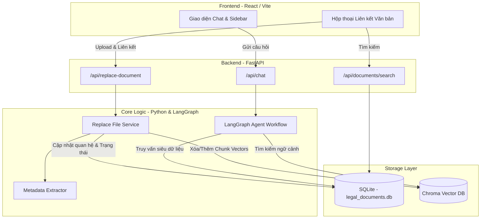
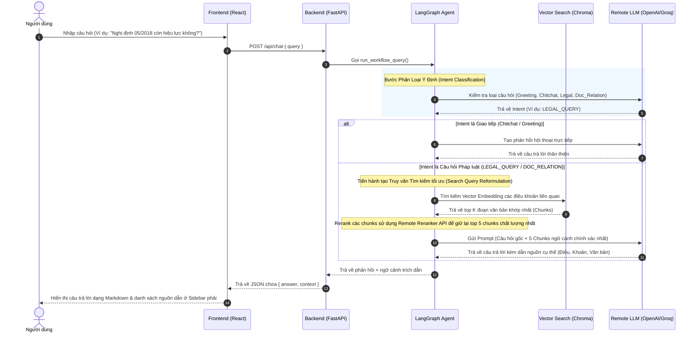
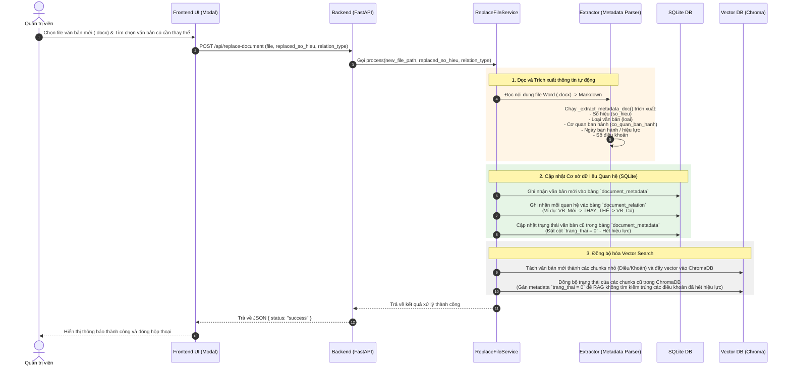
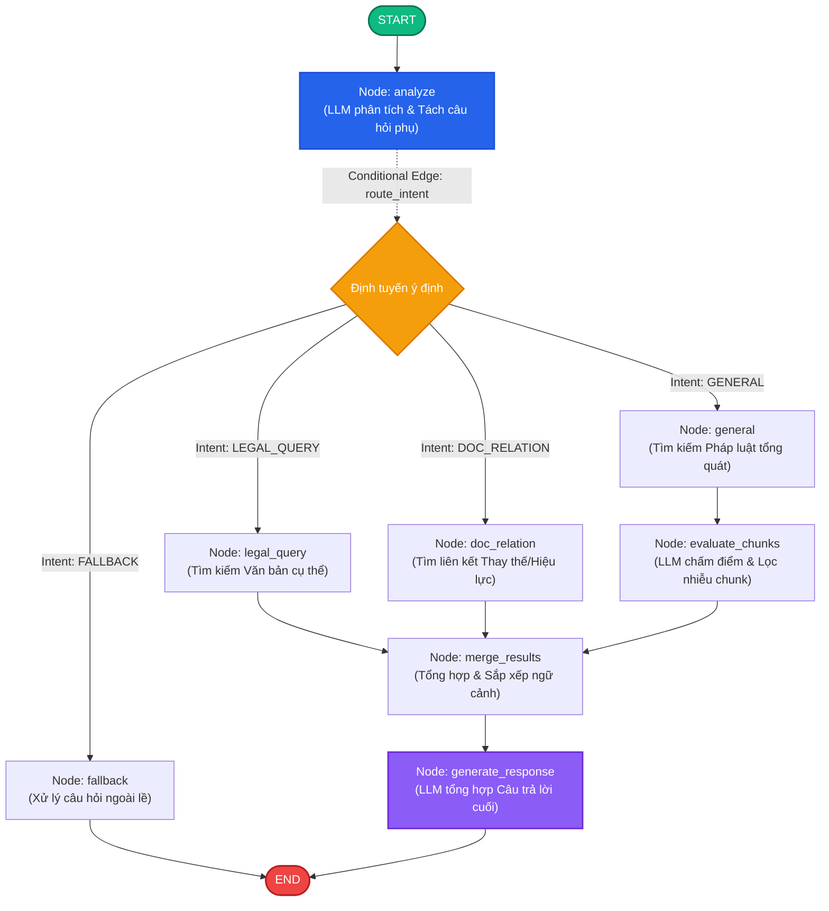

# Hệ Thống Hỏi Đáp Pháp Lý Việt Nam (Legal-QA)

Hệ thống Hỏi đáp Pháp luật Việt Nam (Legal-QA) là giải pháp **Agentic RAG (Retrieval-Augmented Generation)** tiên tiến kết hợp **Hệ quản trị tài liệu liên kết (Linked Document Management System)**. Hệ thống cho phép người dùng đặt câu hỏi bằng ngôn ngữ tự nhiên và nhận được câu trả lời chuẩn xác, đáng tin cậy, đồng thời trích dẫn chi tiết đến từng Điều, Khoản, Điểm cụ thể từ nguồn tài liệu gốc.

Hệ thống giải quyết triệt để hai thách thức lớn nhất của các hệ thống RAG truyền thống khi áp dụng vào lĩnh vực pháp luật: tính mơ hồ, đa nghĩa, đa tầng của câu hỏi người dùng (được giải quyết bằng tác nhân thông minh Agentic RAG) và tính thay đổi, cập nhật liên tục của hiệu lực văn bản pháp lý (được quản lý chặt chẽ bằng cơ chế tài liệu liên kết dữ liệu kép giữa SQLite và ChromaDB).

---

## Tính Năng Nổi Bật

*   **Phân rã văn bản pháp lý dạng cây phả hệ (Hierarchical Tree-RAG):** Thay vì chia nhỏ văn bản thô theo ký tự cố định (Naive Chunking), hệ thống bóc tách cấu trúc văn bản pháp luật Việt Nam (Phần, Chương, Mục, Điều, Khoản, Điểm) giữ nguyên bối cảnh ngữ cảnh bằng cơ chế "Làm giàu Ngữ cảnh cha-con" (`parent_context`).
*   **Quản lý hiệu lực & liên kết tài liệu:** Theo dõi chặt chẽ trạng thái hiệu lực (`trang_thai = 1` còn hiệu lực, `trang_thai = 0` hết hiệu lực). Cho phép Quản trị viên tải lên văn bản mới và cập nhật đồng bộ đồ thị quan hệ thay thế (`document_relation`), tự động loại trừ các văn bản cũ hết hiệu lực khỏi bộ tìm kiếm RAG để chống ảo tưởng (hallucination).
*   **Đồ thị Agent thông minh (LangGraph Agentic Workflow):** Phân loại ý định câu hỏi (Intent Classification), bóc tách câu hỏi phức tạp thành nhiều câu hỏi phụ (Sub-queries), định tuyến song song (Map-Reduce pattern), lọc nhiễu bối cảnh chủ động bằng trí tuệ nhân tạo (LLM-as-a-Judge) trước khi tổng hợp câu trả lời cuối.
*   **Chiến lược tìm kiếm nâng cao:** Đối sánh mờ (Fuzzy Matching) tiếng Việt, chuẩn hóa và đồng bộ chữ số La Mã tự động, loại bỏ các đoạn cắt trùng lặp (Redundant filtering), đánh giá tham chiếu ngang liên văn bản bằng AI (`_evaluate_refs`) và tái sắp xếp hai tầng (Reranking sử dụng mô hình học sâu nội bộ hoặc Remote Reranker API).
*   **Giao diện trực quan (React & Vite):** Khung chat thời gian thực mượt mà kèm Sidebar tự động hiển thị danh sách chi tiết các nguồn trích dẫn trực quan và hộp thoại (Modal) quản trị liên kết tài liệu.

---

## Kiến Trúc Hệ Thống (Architecture Overview)

Hệ thống được tổ chức thành 4 phân lớp chức năng rõ rệt, đảm bảo tính mô-đun hóa cao, phân tách nhiệm vụ rõ ràng và dễ dàng mở rộng độc lập:



### Chi Tiết Các Lớp Chức Năng:

1.  **Lớp Giao Diện Người Dùng (Client Layer):** Được viết trên nền tảng **React JS**, **Vite** và **Tailwind CSS**. Cung cấp giao diện chat mượt mà, sidebar hiển thị nguồn trích dẫn sống động, và hộp thoại quản lý liên kết tài liệu chuyên sâu dành cho quản trị viên.
2.  **Lớp Cổng Giao Tiếp API (API Gateway Layer):** Sử dụng **FastAPI** (Python) hỗ trợ lập trình bất đồng bộ hoàn hảo, xử lý đa luồng hiệu năng cao, cung cấp các đầu cuối `/api/chat`, `/api/documents/search` và `/api/replace-document`.
3.  **Lớp Động Cơ Xử Lý Cốt Lõi (Core Processing Layer):** 
    *   *LangGraph Agent Workflow:* Điều phối đồ thị trạng thái, phân tích câu hỏi và gọi các công cụ tìm kiếm phù hợp.
    *   *Metadata Extractor:* Tự động bóc tách và chuẩn hóa thông tin hành chính văn bản pháp luật tiếng Việt bằng Regular Expression (Regex).
    *   *Replace File Service:* Xử lý nghiệp vụ thay thế hiệu lực kép khi có tài liệu mới được tải lên.
4.  **Lớp Lưu Trữ Dữ Liệu Kép (Database & Storage Layer):**
    *   **SQLite (`legal_documents.db`):** Lưu trữ siêu dữ liệu quan hệ có cấu trúc chặt chẽ (`document_metadata`), mối quan hệ đồ thị liên kết (`document_relation`), và nội dung văn bản gốc để hiển thị.
    *   **Chroma Vector DB:** Lưu trữ các đoạn cắt văn bản dưới dạng vector embedding 1536 chiều (tạo bởi OpenAI) hoặc 256 chiều (ONNX), phục vụ tìm kiếm ngữ nghĩa (Semantic Search).

---

## Các Luồng Hoạt Động (Detailed Workflows)

### Luồng A: Hỏi Đáp Pháp Luật Thông Minh (Agentic RAG Q&A Workflow)

Luồng này xử lý vòng đời của một câu hỏi pháp lý từ khi người dùng nhập yêu cầu vào giao diện cho đến khi nhận được câu trả lời hoàn chỉnh kèm nguồn dẫn trực quan ở Sidebar. Hệ thống không thực hiện tìm kiếm vector mù quáng mà sử dụng **LangGraph Workflow** để phân loại ý định và tối ưu hóa truy vấn chủ động.



---

### Luồng B: Tải Lên & Thiết Lập Liên Kết Văn Bản Mới (Upload & Document Replacement)

Luồng này duy trì tính chính xác về mặt thời gian và hiệu lực pháp luật. Khi một văn bản pháp lý mới được ban hành để thay thế, sửa đổi một văn bản cũ, hệ thống cho phép cập nhật đồng thời cả mối quan hệ đồ thị (SQLite) và trạng thái tìm kiếm ngữ nghĩa (ChromaDB) thông qua một quy trình tự động hóa khép kín:



---

## Đồ Thị Trạng Thái Agentic RAG Bằng LangGraph

Hệ thống sử dụng **LangGraph** để xây dựng đồ thị trạng thái tuần tự kết hợp xử lý song song nhiều câu hỏi phụ (Map-Reduce pattern). Điều này giúp tối ưu hóa bối cảnh, tăng tốc độ xử lý và cải thiện tính chính xác của câu trả lời.



### Mô Tả Chi Tiết Hoạt Động Của Từng Node:

*   **Node `analyze`:** Nhận câu hỏi thô từ người dùng, sử dụng LLM để tách câu hỏi phức tạp thành nhiều câu hỏi phụ (Sub-questions), gán nhãn ý định (`LEGAL_QUERY`, `DOC_RELATION`, `GENERAL`, `FALLBACK`) và tìm kiếm thực thể pháp lý.
*   **Edge `route_intent`:** Sử dụng **LangGraph Send API** để định tuyến song song các câu hỏi phụ đến các nút xử lý chuyên biệt độc lập (Multi-threading).
*   **Nút xử lý song song:**
    *   **Node `legal_query`:** Truy vấn SQLite để lấy siêu dữ liệu và ChromaDB để lấy văn bản điều khoản khi câu hỏi chỉ định rõ văn bản.
    *   **Node `doc_relation`:** Tra cứu trực tiếp bảng `document_relation` của SQLite để tìm liên kết hiệu lực thay thế.
    *   **Node `general`:** Thực hiện tìm kiếm ngữ nghĩa toàn bộ kho lưu trữ khi câu hỏi mang tính khái quát.
*   **Node `evaluate_chunks` (LLM-as-a-Judge):** LLM chấm điểm mức độ liên quan của các chunks được lấy từ ChromaDB trong luồng `general`, lọc bỏ thông tin nhiễu để tránh làm loãng câu trả lời.
*   **Node `fallback`:** Trả lời trực tiếp các câu chào hỏi hoặc câu hỏi ngoài lề và kết thúc sớm mà không kích hoạt tìm kiếm RAG.
*   **Node `merge_results`:** Đóng vai trò là điểm hội tụ (Reduce Node), thu thập kết quả từ các luồng song song, sắp xếp và tinh lọc bối cảnh ngữ cảnh.
*   **Node `generate_response`:** Sử dụng ngữ cảnh siêu sạch từ `merge_results` đưa vào Prompt chuyên biệt để LLM sinh câu trả lời Markdown hoàn chỉnh và trích dẫn nguồn chi tiết.

---

## Tổ Chức Dữ Liệu Hình Cây Phân Cấp (Hierarchical Tree-RAG Schema)

Hệ thống xây dựng một cấu trúc dữ liệu đồ thị hình cây phân cấp hoàn chỉnh kế thừa quan hệ cha-con.

### Lớp mô hình dữ liệu (Pydantic Models)
Định nghĩa tại [src/core/models.py](file:///d:/PTIT/BTL/NLP/src/core/models.py):
1.  **`DocumentMetadata` (Thông tin hành chính):** `so_hieu` (Khóa chính dạng slug), `ten_van_ban`, `loai`, `co_quan_ban_hanh`, `ngay_ban_hanh`, `ngay_co_hieu_luc`, `trang_thai`, `so_dieu`.
2.  **`DocumentRelation` (Mối quan hệ liên kết đồ thị):** `entity_start`, `entity_end`, `relation_type` (thay_the, sua_doi_bo_sung, can_cu, v.v.), `description`.
3.  **`DocumentNode` (Nút cây tài liệu):** `id` (dạng phả hệ, ví dụ: `108_2020_tt-btc.dieu_1.khoan_1`), `type` (dieu, khoan, diem, v.v.), `parent_id`, `parent_context` (nội dung tóm tắt của nút cha để "làm giàu ngữ cảnh" cho các nút lá con), `title`, `content`, `full_text`, `reference` (danh sách liên kết tham chiếu ngang).

### Ý nghĩa của việc thiết kế cây phân cấp
1.  **Định vị nhanh:** Cấu trúc dấu chấm trong `chunk_id` giúp xác định tức thời vị trí điều khoản.
2.  **Làm giàu Ngữ cảnh:** Nút con (ví dụ: *"a) Mức thù lao tối thiểu..."*) khi đứng độc lập sẽ mất ngữ cảnh. Hệ thống tự động đẩy nội dung Điều cha + Khoản cha (`parent_context`) vào nút lá con để khi Vector Search tìm thấy điểm này, LLM vẫn có đầy đủ thông tin để trả lời chuẩn xác.
3.  **Tham chiếu thông minh:** Mỗi nút lá tự động lưu danh sách `reference` đến các văn bản khác để hỗ trợ tìm kiếm liên kết ngang.

---

## Các Chiến Lược Tìm Kiếm & Công Cụ Nâng Cao

Hệ thống tích hợp các thuật toán xử lý dữ liệu tinh tế tại [src/agent/tools.py](file:///d:/PTIT/BTL/NLP/src/agent/tools.py) và [src/search/search.py](file:///d:/PTIT/BTL/NLP/src/search/search.py):

1.  **Chiến lược lọc thừa kế cha-con (`_filter_redundant_chunks`):** Khi cả nút cha (Điều) và nút con (Khoản) cùng xuất hiện trong kết quả tìm kiếm tương đồng, thuật toán sẽ tự động phân tích phả hệ và loại bỏ nút con trùng lặp để tiết kiệm token và tránh lặp từ.
2.  **Đánh giá tham chiếu bằng AI (`_evaluate_refs` - LLM-as-a-Judge):** Đối với các tham chiếu liên văn bản, hệ thống thực hiện Batch Query để xác thực, sau đó sử dụng LLM chấm điểm mức độ cần thiết (ngưỡng `>= 6.0`) để chỉ giữ lại tối đa 3 tham chiếu đắc lực nhất, tránh bùng nổ bối cảnh (Context Explosion).
3.  **Đối sánh mờ & Đồng bộ số La Mã:**
    *   *Fuzzy Matching:* Sử dụng thuật toán đo lường tỷ lệ tương đồng ký tự `difflib.SequenceMatcher` sau khi chuẩn hóa xóa dấu tiếng Việt (`_normalize_vn`) để tìm kiếm văn bản theo tên gọi thông thường bất kể sai lệch chính tả.
    *   *Đồng bộ số La Mã:* Tự động chuyển đổi các định dạng số tự nhiên hoặc số La Mã viết hoa/thường (Chương VI, chương 6) về dạng số La Mã viết thường tiêu chuẩn (`_convert_to_roman_lower`) trước khi truy vấn dữ liệu.
4.  **Truy vấn phân tầng & Lọc ngưỡng:** Thiết lập mặc định lọc trước chỉ quét qua các nút lá thực tế chứa nội dung luật (`LEAF_NODE_TYPES = ['dieu', 'khoan', 'diem']`), tránh tìm trúng nút tiêu đề rỗng. Áp dụng lọc cứng khoảng cách tương đồng (Distance Thresholding) đối với cơ chế Cosine của ChromaDB.
5.  **Tái xếp hạng hai tầng độc lập (Reranking):** Hỗ trợ linh hoạt mô hình Cross-Encoder nội bộ (`AITeamVN/Vietnamese_Reranker` tải lên GPU/CPU) hoặc Remote Reranker API để tối ưu hóa điểm số tương tác ngữ nghĩa thực tế của kết quả tìm kiếm.

---

## Cấu Trúc Thư Mục Dự Án

```
NLP/
├── main.py                          # Điểm chạy CLI (Giao diện menu tương tác)
├── api_server.py                    # Máy chủ API FastAPI chính
├── pyproject.toml                   # Cấu hình dự án và dependencies
├── uv.lock                          # Tệp khóa dependency của uv (tối ưu hóa tốc độ)
├── README.md                        # Tài liệu hướng dẫn chính này
├── SETUP.md                         # Hướng dẫn cài đặt chi tiết
│
├── configs/                         # Thư mục chứa cấu hình
│   ├── search_config.yaml           # Cấu hình tìm kiếm, embedding, reranker, rag
│   └── prompts/                     # Các template prompt cho LLM và bóc tách
│       ├── rag_answer_prompt.txt    # Prompt sinh câu trả lời RAG kèm trích dẫn
│       └── legal_ref_extraction.txt # Prompt trích xuất tham chiếu pháp lý bằng LLM
│
├── src/                             # Mã nguồn chính của ứng dụng
│   ├── agent/                       # LangGraph Agent và các Tools nghiệp vụ
│   │   ├── graph.py                 # Định nghĩa đồ thị trạng thái Agent
│   │   ├── nodes.py                 # Cấu phần các Node (intent, search, generate)
│   │   ├── tools.py                 # Bộ công cụ lọc, đối sánh mờ, chuẩn hóa La Mã
│   │   └── schemas.py               # Định nghĩa schema truyền nhận dữ liệu
│   ├── api/                         # Cổng API gọi các LLMs từ xa
│   │   ├── remote_client.py         # HTTP API Client tổng quát
│   │   └── nvidia_api_client.py     # NVIDIA API tương thích OpenAI
│   ├── core/                        # Logic miền cốt lõi (Domain logic)
│   │   ├── enums.py                 # Enum định nghĩa loại văn bản, loại quan hệ
│   │   └── models.py                # Định nghĩa Pydantic Models (Metadata, Node, v.v.)
│   ├── indexing/                    # Đường ống nạp dữ liệu (Ingestion pipeline)
│   │   ├── indexing.py              # Bộ điều phối tiến trình lập chỉ mục chính
│   │   ├── chunker/                 # Các chiến lược cắt nhỏ văn bản (hierarchical/fixed)
│   │   ├── embedding/               # Xử lý vector embedding (ONNX nội bộ hoặc Remote API)
│   │   ├── ingestion/               # Đọc và bóc tách thô tệp PDF/DOCX
│   │   ├── parsing/                 # Phân tích cú pháp cấu trúc và metadata tự động
│   │   └── vector_store/            # Lớp bọc tương tác với ChromaDB
│   ├── rag/                         # Tầng dịch vụ RAG
│   │   └── service.py               # RAG service điều phối tìm kiếm + sinh câu trả lời
│   ├── search/                      # Module tìm kiếm và xếp hạng lại
│   │   ├── search.py                # SearchService (truy xuất + lọc khoảng cách)
│   │   └── reranker.py              # Tái xếp hạng Cross-Encoder (Local/Remote)
│   └── system/                      # Các dịch vụ hệ thống mức nền tảng
│       ├── database/                # SQLAlchemy ORM, repository quản lý SQLite
│       ├── replace_file_service.py  # Dịch vụ thay thế tài liệu đồng bộ kép
│       └── relationship_builder.py  # Dịch vụ thiết lập liên kết đồ thị văn bản
│
├── models/                          # Lưu trữ cục bộ các mô hình AI (như ONNX embedding)
├── chroma_db/                       # Thư mục lưu trữ cơ sở dữ liệu vector ChromaDB
├── database/                        # Lưu trữ file cơ sở dữ liệu SQLite (.db)
├── logs/                            # Thư mục lưu trữ nhật ký hoạt động (app_*.log)
├── migrations/                      # Tập lệnh cập nhật cấu trúc cơ sở dữ liệu (migration)
├── scripts/                         # Các tập lệnh tiện ích bổ trợ hệ thống
├── test/                            # Bộ kiểm thử đơn vị và tích hợp
└── evaluate/                        # Bộ tài liệu đánh giá chất lượng (100+ câu hỏi kiểm thử)
```

---

## Danh Sách API Endpoints

Hệ thống API hỗ trợ đầy đủ tài liệu tương tác tự động. Khi chạy máy chủ, bạn có thể truy cập Swagger UI tại: `http://localhost:8000/docs`

| Phương Thức | API Endpoint | Mô Tả Nghiệp Vụ |
| :--- | :--- | :--- |
| **POST** | `/api/chat` | Hỏi đáp pháp lý thông minh qua luồng Agentic RAG |
| **GET** | `/api/documents` | Lấy danh sách toàn bộ tài liệu pháp lý đang hoạt động |
| **GET** | `/api/documents/search` | Tìm kiếm siêu dữ liệu tài liệu (theo Số hiệu hoặc Tên văn bản) |
| **GET** | `/api/relation-types` | Lấy danh sách các loại quan hệ liên kết hỗ trợ |
| **POST** | `/api/replace-document` | Tải lên văn bản mới và thiết lập liên kết thay thế đồng bộ kép |

### Ví dụ Sử dụng API với cURL:

```bash
curl -X 'POST' \
  'http://localhost:8000/api/chat' \
  -H 'accept: application/json' \
  -H 'Content-Type: application/json' \
  -d '{
  "query": "Hợp đồng lao động phải có những nội dung chủ yếu nào?",
  "top_k_retrieve": 20,
  "top_k_rerank": 5,
  "use_remote_embedding": true,
  "use_remote_rerank": true
}'
```

### Ví dụ Sử dụng API với Python:

```python
import requests

url = "http://localhost:8000/api/chat"
payload = {
    "query": "Nghị định 05/2018 còn hiệu lực thi hành không?",
    "top_k_retrieve": 20,
    "top_k_rerank": 5
}

response = requests.post(url, json=payload)
data = response.json()

print("Câu trả lời từ hệ thống:")
print(data["answer"])
print("\nCác nguồn trích dẫn:")
print(data["context"])
```

---

*Để biết thêm chi tiết về cách cài đặt, cấu hình và chạy hệ thống, vui lòng tham khảo tài liệu [SETUP.md](SETUP.md).*